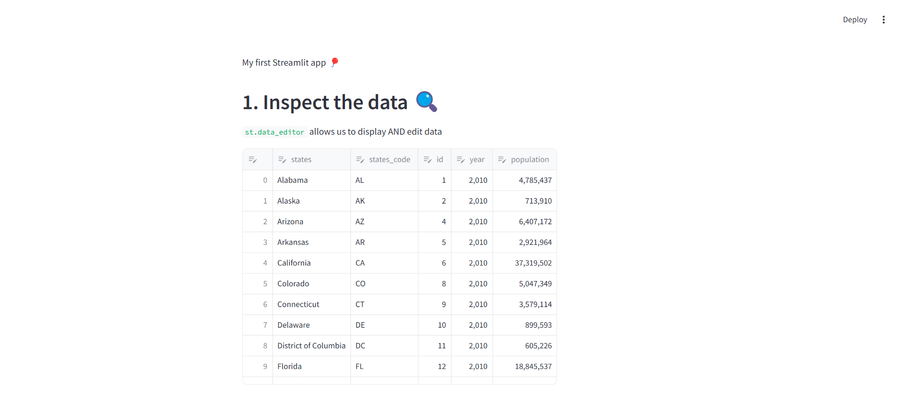
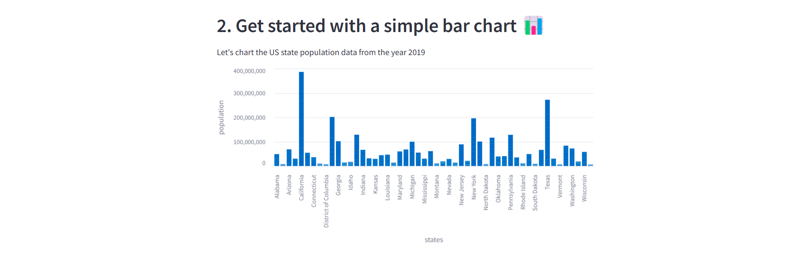
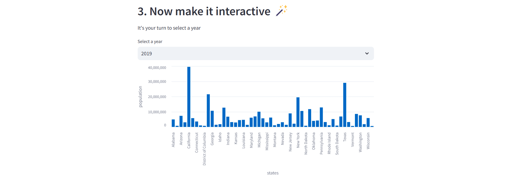
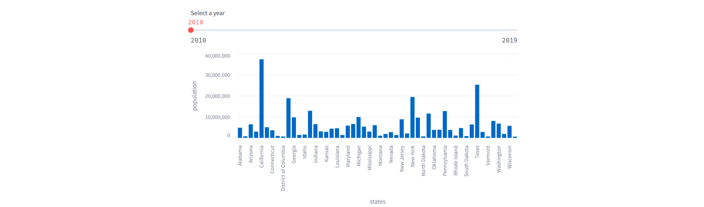
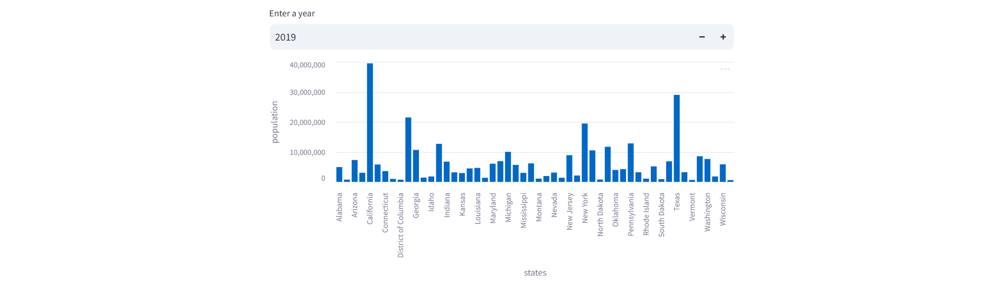
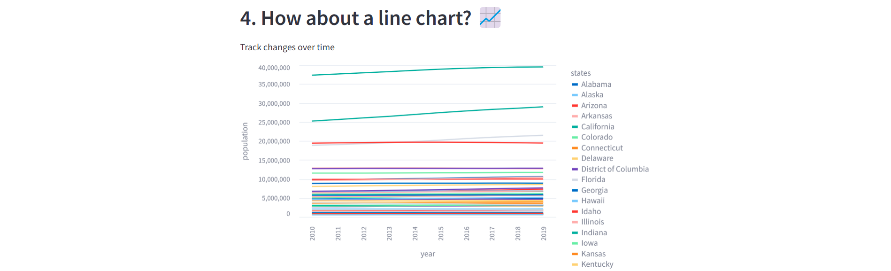
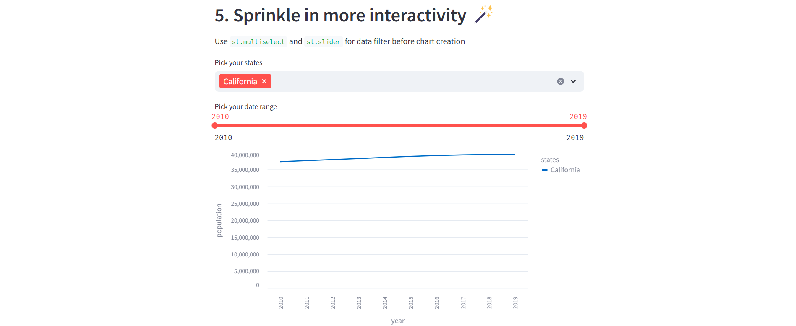

# Tarea 04

## 1. Revisar el siguiente blog sobre pruebas de concepto.

**Objetivo:**

* Entender qué es una POC

Una POC es una prueba de concepto, un experimento controlado que tiene como objetivo validar la viabilidad de una idea en un entorno real. Se trata de demostrar que la solución puede cumplir con todos los requerimientos técnicos y de negocio solicitados por la organización.

* ¿Cuáles son los objetivos de una POC?
  * Validar la viabilidad técnica de una idea.
  * Mitigar riesgos.
  * Probar la integración con los sistemas existentes.
  * Estimar costos y tiempos de implementación.
  * Evaluar el impacto en el negocio

* ¿Por qué una POC se debe de diseñar con el fin de ponerla en producción?

Debido a que el fin último será poner en producción para aportar un valor real al negocio. Asimismo, se prueba tanto la funcionalidad como la capacidad de operar en condiciones reales para minimizar riesgos futuros. Además, así se podrán identificar los recursos necesarios para la implementación.

* ¿Cuáles deben de ser los resultados de una POC exitosa?
  * Validación técnica
  * Identificación y mitigación de riesgos
  * Integración y cumplimiento de seguridad
  * Evidencias de impacto en el negocio
  * Plan de evolución a producción

* ¿Cómo se relaciona la POC al prototipo del problema de las casas o ventas que realizaste en la tarea 02?

El prototipo realizado en la tarea 2 permite explorar la viabilidad de una idea, en este caso, el poder predecir el precio de una casa dada la información con la que contamos. Asimismo, se identificaron áreas de mejora que se implementarían para poder llegar a una versión final del modelo.

* ¿Qué resultados lograste obtener de construir el prototipo en el notebook?

Se logró obtener un modelo que predice el precio de la casa, si bien el error no es tan alto, aun se puede mejorar bastante. Además, se identificaron las variables que brindan un mayor aporte como una base para poder evolucionar este modelo.

* ¿Qué hallazgos van a influenciar tus decisiones para convertir esto en un producto de datos que sea usable?

La rapidez del modelo, la precisión y la capacidad de escalarlo para poder ser utilizado por otros usuarios. Asimismo, se debe de considerar la seguridad de los datos y la capacidad de integración con una interfaz amigable con el usuario que le permita utilizar el producto de datos.

Responder preguntas vía PDF en el CANVAS.

**Lecturas:**

* [Generative AI: Getting Proofs-of-Concept to Production](https://aws.amazon.com/blogs/enterprise-strategy/generative-ai-getting-proofs-of-concept-to-production/)

## 2. Revisar los siguientes blogs sobre Exception Handling en Python

**Objetivo:**

* Reforzar los concepto de manejo de excepciones en el código.
  * Raise
  * Assert
  * Try-Except-Else-Finally
  * Finally

* Entender porque es importante usar esto en el código.

El manejor de excepciones nos permiten capturar los errores que pueden ocurrir durante la ejecución de un programa para manejarlos de una manera controlada. Esto nos permite evitar que el programa se detenga de manera inesperada y poder dar un mensaje de error más amigable al usuario o debuggear el código de manera más eficiente.

* Cómo se estructura un `try except` clause.

```python
try:
    # Código que puede lanzar una excepción
except Exception as e:
    # Código que se ejecuta si se lanza una excepción
else:
    # Código que se ejecuta si no se lanza una excepción
finally:
    # Código que se ejecuta siempre
```

* Cómo utilizar los `built-in` exception vs un `custom` exception.

Las `built-in` exceptions son las que ya vienen definidas en Python y se utilizan para manejar errores comunes. Por otro lado, las `custom` exceptions son aquellas que se definen por el usuario para manejar errores específicos de su programa, para ello podemos crear una clase que herede de `Exception`.

* Cómo y para qué se utiliza los `assert`:

El `assert` se utiliza para verificar que una condición se cumpla, si no se cumple, se lanza una excepción de tipo `AssertionError`. Se utiliza para verificar que las condiciones que se esperan se cumplan y de esta manera poder detectar errores en el código de manera temprana. Sin embargo, en producción se recomienda no utilizarlo ya que se puede desactivar fácilmente con las opcioones -O y -OO.

**Lecturas:**

* [Python Exceptions: An Introduction](https://realpython.com/python-exceptions/)
* [Python's raise: Effectively Raising Exceptions in Your Code](https://realpython.com/python-raise-exception/)

Responder preguntas vía PDF en el CANVAS.

## 3. Revisar la demo de StreamLit

**Objetivo:**

* Conocer la utilidad de esta herramienta desde la perspectiva de construir pruebas de concepto para *data science*.

Streamlit es una herramienta de código abierto que permite construir aplicaciones interactivas de forma rápida y sencilla.

* Reproducir en su ambiente local, el ejemplo que viene en el blog. (Ojo, en el blog sugiere hacerlo desde Github, lo más sencillo es usen el ambiente de la clase de `arquitectura`, solo tienen que instalar Streamlit).

* Cómo puedo habilitar a usuarios externos utilizar mi aplicación.

Para permitir que usuarios externos accedan a nuestra aplicación podemos usar distintas opciones:
  -  Streamlit Community Cloud: servicio gratuito que permite desplegar aplicaciones de Streamlit en la nube al tener el código en un repositorio de GitHub.
  -  Servidor: podemos instalar Streamlit en un servidor y permitir que los usuarios accedan a la aplicación a través de una URL. El puerto por defecto es el 8501.

* ¿En qué se diferencia con Shiny?

Si bien ambos están diseñados para crear aplicaciones interactivas como un producto de datos, Streamlit es más sencillo y rápido de utilizar ya que está diseñado para ser utilizado sin conocimientos previos en desarrollo web. Por otro lado, Shiny es más completo y permite una mayor personalización de la aplicación ya que existe una separación entre la interfaz y la lógica. Además, Shiny está diseñado para ser utilizado con R, mientras que Streamlit está basado en Python.

* Demo









**Demo**:

* [Streamlit 101 python data app](https://blog.streamlit.io/streamlit-101-python-data-app/)

## Entrega

* Miércoles 12 de febrero
* Las preguntas via PDF en Canvas